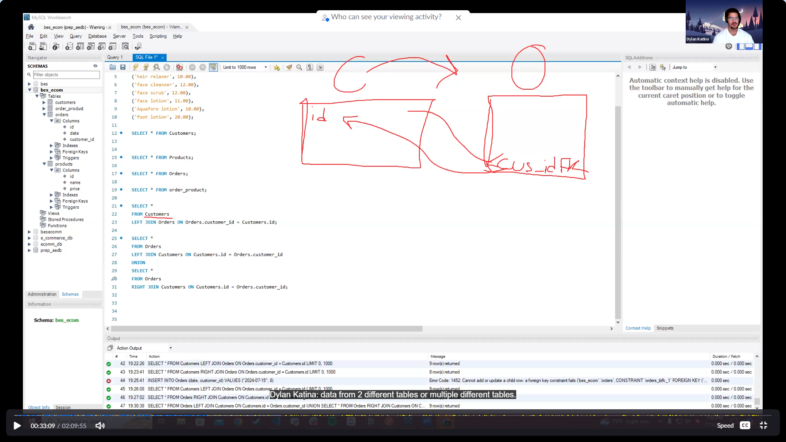
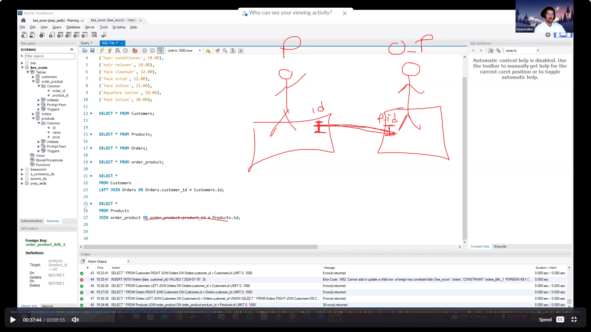
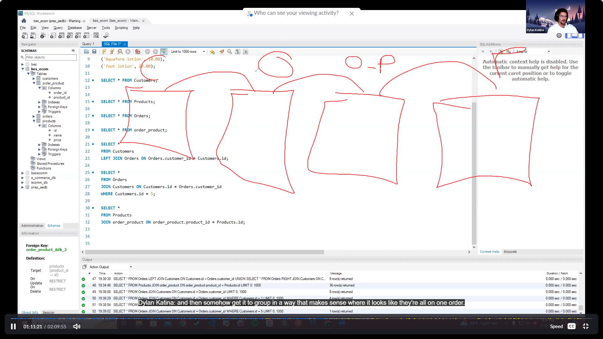

## Learning Objectives

- The students should be able to apply advanced querying techniques using SQLAlchemy, such as filtering data and performing joins with custom query builders.
- The students should be able to demonstrate an understanding of ORM optimization techniques like pagination for large data sets.
- The students should be able to explain the concepts of lazy loading and eager loading in ORM and demonstrate their application in SQLAlchemy.


#### Advanced SQL Querying

* **JOINS**: Allow us to utilize the relationships between tables and query information from multiple tables at a time so long as they share relationships.

    * **INNER JOIN**: Grabs overlapping information from two tables. (Entry from one table has to be connected to an entry from the other. If an item is not connected to and item from the other it is not included)
    * **LEFT JOIN**: Grabs all the information that is overlapping, aswell as any non connected items from the 'left' table (the starting table).
    * **RIGHT JOIN**: Grabs all the information that is overlapping, aswell as any non connected items from the 'right' table (the table we are joining to).
    * **FULL OUTER JOIN**: Grabs all info connect or not from both tables.

## 1. Introduction to Joins
- **Joins** allow you to utilize relationships between tables.
- You can query information from multiple tables, or from one table where a condition in another table is true.

## 2. Types of Joins
- **Inner Join**:
  - Retrieves only the overlapping information from two different tables.
  - Example: If a customer has placed an order, only that customer's information will be retrieved.
  
- **Left Join**:
  - Retrieves all information from the left table, even if there is no matching record in the right table.
  - Example: Shows all customers (A, B, C) and any orders, even if some customers haven't placed an order.
  
- **Right Join**:
  - Similar to a left join but in reverse, retrieving all information from the right table.
  - Example: Retrieves all orders and any matching customer information, even if the customer no longer exists.
  
- **Full Outer Join**:
  - Retrieves all information from both tables, regardless of whether there is a match between them.
  - Example: Shows all customers and all orders, regardless of any existing relationships.

## 3. Practical Tips
- Focus on mastering one type of join; for example, a left join can achieve the same result as a right join depending on which table you start with.
- The left table is the one you are starting with in your join operation.

## 4. Example Summary
- **Inner Join**: Returns only matching records between tables.
- **Left Join**: Returns all records from the left table and matching records from the right table.
- **Right Join**: Returns all records from the right table and matching records from the left table.
- **Full Outer Join**: Returns all records from both tables, regardless of matching.

## 5. Example Summary
- **Inner Join**: Only matching records are returned.
- **Left Join**: All records from the left table and matching records from the right.
- **Right Join**: All records from the right table and matching records from the left.
- **Full Outer Join**: All records from both tables, with NULLs where there is no match.

# `GO TO SQL BENCH and write the following:`
```sql
INSERT INTO customers (name, email, phone, username, password)
VALUES
('Bob', 'bob@email.com', '555-1234', 'bob123', 'password1'),
('Alice', 'alice@email.com', '555-5678', 'alice456', 'password2'),
('Charlie', 'charlie@email.com', '555-8765', 'charlie789', 'password3'),
('Diana', 'diana@email.com', '555-4321', 'diana012', 'password4'),
('Eve', 'eve@email.com', '555-3456', 'eve345', 'password5'),
('Frank', 'frank@email.com', '555-6543', 'frank678', 'password6');

SELECT * FROM Customers;

INSERT INTO products (name, price)
VALUES
('hair shampoo', 10.00),
('hair conditioner', 10.00),
('hair relaxer', 12.00),
('face cleaner', 12.00),
('face scrub', 11.00),
('face lotion', 10.00),
('aquafore lotion', 20.00),
('foot lotion', 10.00);

SELECT * FROM Products;

INSERT INTO Orders (date, customer_id)
VALUES
('2024-08-13', 1),  -- Order for customer with ID 1
('2024-08-14', 2),  -- Order for customer with ID 2
('2024-08-15', 3),  -- Order for customer with ID 3
('2024-08-16', 4),  -- Order for customer with ID 4
('2024-08-17', 5),  -- Order for customer with ID 5
('2024-08-18', 6),  -- Order for customer with ID 6
('2024-08-19', 1),  -- Another order for customer with ID 1
('2024-08-20', 2);  -- Another order for customer with ID 2

SELECT * FROM Orders;

-- Link products to Order ID 1
INSERT INTO Order_Product (order_id, product_id)
VALUES
(1, 1),  -- Product ID 1
(1, 2),  -- Product ID 2
(1, 3);  -- Product ID 3

-- Link products to Order ID 2
INSERT INTO Order_Product (order_id, product_id)
VALUES
(2, 4),  -- Product ID 4
(2, 5),  -- Product ID 5
(2, 6);  -- Product ID 6

-- Link products to Order ID 3
INSERT INTO Order_Product (order_id, product_id)
VALUES
(3, 7),  -- Product ID 7
(3, 8);  -- Product ID 8

-- Link products to Order ID 4
INSERT INTO Order_Product (order_id, product_id)
VALUES
(4, 1),  -- Product ID 1
(4, 2),
(4, 3),
(4, 4);  -- Product ID 4

-- Link products to Order ID 5
INSERT INTO Order_Product (order_id, product_id)
VALUES
(5, 5),  -- Product ID 5
(5, 6),
(5, 7),
(5, 8);  -- Product ID 8

-- Link products to Order ID 6
INSERT INTO Order_Product (order_id, product_id)
VALUES
(6, 1),  -- Product ID 1
(6, 3),
(6, 5),
(6, 7);  -- Product ID 7

-- Link products to Order ID 7
INSERT INTO Order_Product (order_id, product_id)
VALUES
(7, 2),  -- Product ID 2
(7, 4),
(7, 6),
(7, 8);  -- Product ID 8

-- Link products to Order ID 8
INSERT INTO Order_Product (order_id, product_id)
VALUES
(8, 3),  -- Product ID 3
(8, 5),
(8, 7);  -- Product ID 7

SELECT * FROM order_product;


-- Imagine I want to see all the orders that a certain customer has made
-- (INNER JOIN) 
 SELECT *
 FROM customers
 JOIN Orders ON Orders.customer_id = Customers.id;
 
 -- (LEFT JOIN) 
 SELECT *
 FROM customers
 LEFT JOIN Orders ON Orders.customer_id = Customers.id;
 
  -- (RIGHT JOIN) 
 SELECT *
 FROM Orders
 RIGHT JOIN Customers ON Customers.id = Orders.customer_id;
 
 -- (FULL OUTTER JOIN)
SELECT *
FROM Orders
LEFT JOIN Customers ON Customers.id = Orders.customer_id
UNION
SELECT *
FROM Orders
RIGHT JOIN Customers ON Customers.id = Orders.customer_id;


SELECT *
FROM Products
JOIN order_product ON order_product.product_id = Products.id;

SELECT *
FROM Orders
JOIN Customers ON Customers.id = Orders.customer_id
WHERE Customers.id = 1;
```





#### ORM Advanced Querying with SQLAlchemy

`### 1. Overview of Joins
- **Concept:** Making joins allows us to connect different tables in a database.
- **Application:** This capability is crucial for querying a database and setting up a thorough API.
- **Adaptation:** We may need to adapt these concepts to work with SQL or SQLAlchemy.

### 2. Importance of Joins
- **Key Point:** The ability to connect two different tables using a join is vital for advanced queries.

### 3. Creating Advanced Queries
- **Goal:** Start creating advanced queries using SQLAlchemy ORM.
- **Example:** Begin with filtering products using `WHERE`.

### 4. Filtering with WHERE and Filter
- **Concept:** Filtering products can be done using `WHERE`, `filter`, or `filter_by`.
- **Usage:**
  - `WHERE` and `filter` are almost identical in function.
  - `filter_by` differs slightly, as it doesn't require specifying the table being queried.
- **Preference:** It's often better to be explicit about which table's attributes are being queried, so `WHERE` or `filter` is preferred.

### 5. Example Query: Filtering Products by Search Term
- **Scenario:** If a user searches for a product like "lotion," the API should return all products containing "lotion" in their names.
- **Implementation:** This involves creating a new route in the API.

### 6. Starting with Service Layer
- **Approach:** Always begin by setting up the service layer, which is the connection to the database.
- **Example:** Work on the `ProductService` class, ensuring it has methods like `save` and `find` to interact with the product data.`

We can take alot of these querying principles and further enhance the API we have been working on.

- Filtering products using .where(), filter(), filter_by() and a query parameter **search term**
`if somebody was using my API. They were searching up. I want to see what kind of lotions this person has, if they typed in lotion everything that has lotion in its name would pop up is essentially the goal of what we want to do. Essentially, that entails creating a whole new route. So let's go ahead and jump right into this and start from service. So we'll always start, you know, front to back or back to front.`
## `1. Go to productService.py`
- Linking orders to products using our products attribute and Nested Schemas .join()
- Searching for order by order_id
- Searching for orders by customer_id
- Searching for orders by customer_name

# `Teaching Guide: ORM and Schema in SQLAlchemy`

## Overview
This lesson focuses on understanding how to utilize SQLAlchemy's ORM (Object Relational Mapping) to simplify database queries, particularly how to set up schemas to effectively deserialize objects and display relationships without complex SQL joins.

## Key Concepts

# `Go to customer.py model`

### 1. **Understanding the Data Model**
   - **Customer Data Model**: In a typical SQL table, fields like `id`, `name`, `email`, `phone`, `username`, and `password` are visible. However, relationships between tables, such as the association of a customer with their orders, are not directly visible.
   - **Implicit Relationships**: Using SQLAlchemy's ORM, you can access related data, such as a customer's orders, through object attributes (e.g., `customer.orders`) without needing explicit SQL joins.

### 2. **Deserialization and Schema Preparation**
   - **Deserialization**: When returning objects like `Customer`, you need to prepare the schema to ensure the information is correctly deserialized for the output.
   - **Schema Setup**: Initially, schemas might only show basic table information. However, they can be extended to include related objects (e.g., orders and associated products) by modifying the schema.

### 3. **Working with Order Schema**
   - **Initial State**: When querying the `Order` schema, you see basic information such as `customer_id`, `date`, and `order_id`.
   - **Schema Extension**: The goal is to modify the `Order` schema to include related products, showing the full details of each product within an order, rather than just product IDs.

### 4. **Nested Schemas**
   - **Defining a Nested Schema**: To include related objects (like products within orders), use the `fields.Nested` function to nest schemas. This allows you to represent the structure of related objects within the main schema.
   - **Example Implementation**:
     ```python
     class OrderSchema(ma.Schema):
         products = fields.Nested(ProductSchema, many=True)
     ```
     - **Explanation**: `products` is the attribute that connects to the related `Product` objects. `ProductSchema` defines what each `Product` should look like, and `many=True` indicates that there are multiple products in an order.

### 5. **Verifying the Schema**
   - **Running Queries**: After modifying the schema, running a query on orders should now return the order details along with all associated products, serialized in JSON format.
   - **Example Output**:
     ```json
     {
         "customer_id": 1,
         "order_id": 1,
         "date": "2024-08-13",
         "products": [
             {"id": 1, "name": "Shampoo"},
             {"id": 2, "name": "Conditioner"},
             ...
         ]
     }
     ```
     - **Front-End Considerations**: This structure is ideal for front-end applications, where users expect to see detailed order information, including all products in a single query.

### 6. **Expanding to Other Relationships**
   - **Including Customer Details**: Just like products, you can nest the `CustomerSchema` in the `OrderSchema` to display customer details associated with each order.
   - **Example Implementation**:
     ```python
     class OrderSchema(ma.Schema):
         customer = fields.Nested(CustomerSchema)
     ```
     - **Use Case**: This is useful when you need to show not only the products in an order but also the customer who placed it.

### 7. **Common Issues and Debugging**
   - **Troubleshooting**: If the schema does not return the expected results, ensure that all schemas are correctly defined and included in the metadata.
   - **Running the Application**: Make sure to re-run the application after schema changes to see the updated results.

## Practical Exercise
- **Step 1**: Start with a basic `Order` schema that shows only `order_id`, `customer_id`, and `date`.
- **Step 2**: Modify the `Order` schema to include related products using the `fields.Nested` function.
- **Step 3**: Add the `CustomerSchema` to display customer information for each order.
- **Step 4**: Run queries to verify that all nested data is correctly serialized and displayed in JSON format.

## Conclusion
This lesson demonstrates the power of SQLAlchemy's ORM in simplifying complex database queries. By effectively using nested schemas, developers can easily include related data in their API responses, improving the overall functionality and user experience of their applications.


`In MySQL this would take me a long time compared to how fast and easy it is for me to do it with an ORM!`

## `search for order by id`
`Where should I start?`
`I already have my schema and model ready so we will start at the service`
# `Go to orderService.py`

##### We'll also discuss the concept of 'Lazy' vs 'Eager' loading:

- Lazy: When we access a relation ship from table1 to table2, only the data from table2 is loaded, and the table1 associate is not

- Eager: Now when accessing a relationship, SQL issues two separate SELECT queries to gather the info from both tables.

# `GO TO ORDER.PY`

#### Pagination:
Pagination allows for optimization when dealing with large datasets. With pagination we are able to carve our data into condensed packages determined by the end user.


# `GO TO CUSTOMERSERVICE.PY`