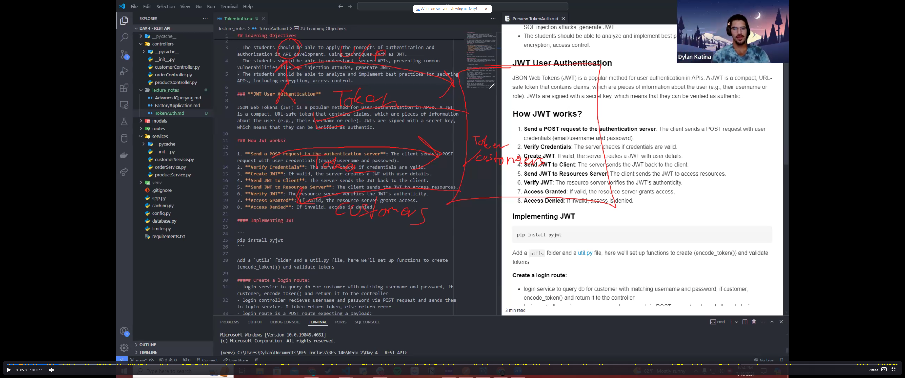
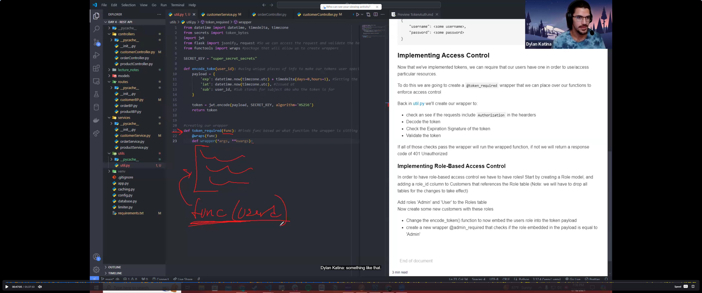

## Learning Objectives

- The students should be able to apply the concepts of authentication and authorization in API development, using techniques such as JWT.
- The students should be able to understand  secure APIs, preventing common vulnerabilities like SQL injection attacks, generate JWT.
- The students should be able to analyze and implement best practices for securing APIs, including encryption, access control.

### **JWT User Authentication**

JSON Web Tokens (JWT) is a popular method for user authentication in APIs. A JWT is a compact, URL-safe token that contains claims, which are pieces of information about the user (e.g., their username or role). JWTs are signed with a secret key, which means that they can be verified as authentic.

### How JWT works?

1. **Send a POST request to the authentication server**: The client sends a POST request with user credentials (email/username and passowrd).
2. **Verify Credentials**: The server checks if credentials are valid.
3. **Create JWT**: If valid, the server creates a JWT with user details.
4. **Send JWT to Client**: The server sends the JWT back to the client.
5. **Send JWT to Resources Server**: The client sends the JWT to access resources.
6. **Verify JWT**: The resource server verifies the JWT's authenticity.
7. **Access Granted**: If valid, the resource server grants access.
8. **Access Denied**: If invalid, access is denied.

# Authentication and Authorization

## Objective
- Understand and apply the concepts of authentication and authorization in API development using techniques such as JWT (Json Web Token).
- Secure APIs and prevent common vulnerabilities like SQL injection attacks.
- Generate JWTs and implement best practices for securing APIs, including encryption and access control.

---

## Detailed Points

### 1. Purpose of Authentication
- Limit access to APIs to ensure that not just anyone can make requests, especially sensitive ones like viewing customer data.
- **Example:** "Maybe we don't want just anybody to access all of our customers, you know, and see all of our customer information."

### 2. Token Authentication
- **JWT (Json Web Token):** 
  - A compact, URL-safe token that contains claims (pieces of information about the user), such as user ID, username, and role.
  - Tokens are signed with a secret key, ensuring they can't be forged unless someone knows the secret key.
  - **Example:** "Json Web tokens are signed with what we call a secret key, which means that they can't be forged unless they do, or unless somebody knows the secret key that we're using."

### 3. Working with JWTs
- **Flow of Authentication:**
  - User sends credentials (username and password) to the server.
  - The server validates the credentials and, if valid, sends back a JWT.
  - The user can then use this token to access token-protected routes.
  - **Example:** "The user will send over their username and their password. With that, I'm going to validate that a user exists with that username and password. And if they do, I'm going to send back a token."
  

- **Token Usage:**
  - The front-end is responsible for keeping track of the token and using it to access protected routes.
  - **Example:** "The front end dev's job is to kind of keep track of that token so that once my user has signed in, they have a token so that they can access all of my token-protected routes."

- **Handshakes:**
  - User sends a POST request with credentials.
  - Server validates and returns a JWT if valid.
  - User sends the token back to access protected resources.
  - Server verifies the token to grant or deny access.

### 4. Security Layers
- **Role-Based Authentication:**
  - Roles (e.g., admin) can be embedded in the JWT, and the server can check the role to grant or restrict access to certain routes.
  - **Example:** "So when I decrypt the token I can check if their role is equal to that of like an admin. I can give them admin permissions to access like admin routes."

- **Advanced Control:**
  - The course will cover basic token authentication, role-based authentication, and other advanced methods of securing APIs, depending on time.
  - **Example:** "But that is really just like scratching the surface of this. There is a ton of different things that you can incorporate into your own kind of authentication process."


#### Implementing JWT

```
pip install pyjwt

pip list

pip freeze > requirements.txt
```

Add a `utils` folder and a util.py file, here we'll set up functions to create (encode_token()) and validate tokens
- `we're actually going to be creating wrappers today to kind of wrap functions
and give those functions additional functionality.`
- `We've worked with wrappers before such as the cache wrapper we used yesterday within the customerController`
- `It basically gives the find_all() function additional functionality of storing cache`
- `That's really all a wrapper does is it's essentially adding a layer of functionality to a function.`
- `I'm adding this cached wrapper to my find. All and essentially all that does is it gives this find all function, additional functionality of storing things in a cache. That's really all a wrapper does is it's essentially adding a layer of functionality to a function.`
- `o we're going to create our own wrappers so that we can apply this jwt. Validation to any function that we want quickly without having to write it into all of our functions.`

##### Create a login route:
### `we're going to create our encode token function.`
- login service to query db for customer with matching username and password, if customer, encode_token() and return it to the controller
- login controller recieves username and password via POST request and sends them to login service. I token return token, else return error
- login route is a POST route expecting a payload:
```
{
    "username": <some username>,
    "password": <some password>
}
```

### Implementing Access Control
Now that we've implemented tokens, we can require that our users have one in order to use/access particular resources.

To do this we are going to create a `@token_required` wrapper that we can place over our functions to enforce access control

## `GO TO THE UTIL.PY AND SET UP OUR WRAPPER`


- `what happens is we're going to place this wrapper on top of a function`
- `When we do that. we're going to pass that function in, or we're essentially going to create a larger function where we're going to add in additional functionality or wrapped functionality.
- `And then we're going to call our func after we go through this. So this is what's going to authorize our token. We're going to check our token out. If everything looks good, we're going to run our function that we're currently wrapping.`
- `The reason this takes in args and kuargs is because potentially, this function needs arguments or it needs keyword arguments. so we set that up on our wrapper. So that if this function is dependent on something like user Id. we can pass that along.`

Back in util.py we'll create our wrapper to:
- check an see if the requests include `Authorization` in the hearders
- Decode the token
- Check the Expiration Signature of the token
- Validate the token

If all of those checks pass the wrapper will run the wrapped function, if not we will return a response code of 401 Unauthorized

#### Implementing Role-Based Access Control

In order to have role-based access control we have to have roles! Start by creating a Role model, and adding a role_id column to Customers that references the Role table (Note: we will have to drop all tables for the changes to take effect)

Add roles 'Admin' and 'User' to the Roles table
Now create some new customers with these roles

- Change the encode_token() function to now embed the users role into the token payload
- create a new wrapper @admin_required that checks if the role embedded in the payload is equal to 'Admin'

- ## `create role.py model`
- ## `GO TO UTIL.PY TO ADD THE ROLE IN THE ENCODE_TOKE`
    - ## `GO TO CUSTOMERSERVICE.PY AND ADD CUSTOMER.ROLE INTO THE LOGIN FUNCTION ENCODE_TOKEN
- ## `run the app and try to log in`
- ## `go to util.py and set up the admin wrapper`
- ## `go to customerController.py and add the admin wrapper to the find_all and find_all_paginate functions`
- ## `Go to postman and copy the auth_token
    - ## `run a get request to the customers with having the auth_token inside the Bearer Token Authorization header
- ## `Lets try it again but sign into Darrens account as hes not an admin`
